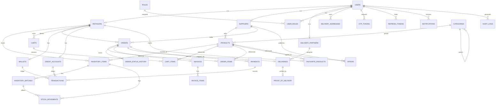

# VyaparSetu V1 - Design Document

## Overview

VyaparSetu V1 is an AI-powered B2B commerce platform connecting retailers and suppliers. This document defines the technical design: database schema, backend architecture, and frontend architecture. It is scoped to V1, which covers:

- Authentication & user management (Mobile/Email OTP + JWT, RBAC)
- Retailer inventory management
- Ordering (cart, repeat, voice, text, image, barcode)
- Supplier dashboard & order fulfilment
- Payments (UPI, Card, Net Banking, Wallet, COD, Credit)
- Delivery partner flow
- Admin
- AI features (chat assistant, smart reorder, demand prediction, text/image/voice-to-order)

The **Bulk Procurement** module is designed to be modular and **disabled by default** in V1. Future modules (marketplace, logistics optimization, credit scoring, etc.) are planned but not implemented.

### Design Principles

- **Clean / layered architecture**: Controller → Service → Repository → Entity. No business logic in controllers.
- **Modular monolith**: feature modules are isolated so they can later be split into microservices.
- **DTO pattern** at all API boundaries; entities never leak to controllers.
- **Centralized exception handling** and **global validation**.
- **RBAC** enforced via JWT claims + method-level security.
- **Inventory integrity**: stock can never go negative; all stock changes are recorded as movements (event-sourced ledger style).
- **Mobile-first, low-friction UX**: ordering completes in under 30 seconds.

---

## Architecture

### High-Level Flow

```
React 19 (Vite, Tailwind, DaisyUI, Zustand, React Query)
        │  HTTPS / JWT
        ▼
REST API  (/api/v1/**, versioned, Swagger documented)
        ▼
Spring Boot 3.x  (Controller layer - thin)
        ▼
Service Layer  (business logic, transactions)
        ▼
Repository Layer  (Spring Data JPA)
        ▼
MySQL  (+ Redis-ready cache, WebSocket for real-time)
```

### Backend Module Boundaries (Modular Monolith)

Each module is a package with its own controller/service/repository/dto/mapper/entity sub-packages. Modules communicate through service interfaces, not direct repository access.

```
com.vyaparsetu
├── common            // shared: exceptions, response wrappers, base entities, utils, security
├── auth              // OTP, JWT, login/registration, token refresh
├── user              // users, roles, profiles (retailer/supplier/delivery/admin)
├── catalog           // products, categories
├── inventory         // stock, batches, expiry, stock movements, alerts
├── order             // cart, orders, order items, order state machine
├── ordering_ai       // text/voice/image/barcode → structured order
├── payment           // payments, transactions, wallet, credit accounts
├── delivery          // delivery assignments, OTP, proof of delivery, COD
├── invoice           // invoice generation (PDF), GST
├── notification      // push, in-app, email, WhatsApp (optional), SMS-ready
├── report            // sales/profit/purchase/inventory reports
├── ai                // chat assistant, demand prediction, smart reorder, insights
├── procurement       // bulk procurement (DISABLED by default via feature flag)
└── admin             // cross-cutting admin operations, system config
```

### Cross-Cutting Concerns

| Concern | Approach |
|---|---|
| AuthN | JWT access token (short-lived) + refresh token. OTP issuance via SMS/email provider. |
| AuthZ | Spring Security `@PreAuthorize` with role claims; `RoleBasedAccess` filter. |
| Validation | Jakarta Bean Validation on DTOs + `@Valid`; custom validators for GST/phone. |
| Exceptions | `@RestControllerAdvice` global handler → standardized `ApiError` response. |
| Logging | SLF4J + structured JSON logs; correlation/request ID via MDC. |
| Rate limiting | Bucket4j (Redis-ready) on auth + AI endpoints. |
| Caching | Spring Cache abstraction, Redis-ready (catalog, supplier price lists). |
| Real-time | WebSocket (STOMP) for order status + notifications. |
| API docs | springdoc-openapi → Swagger UI at `/swagger-ui`. |
| Feature flags | `app.features.procurement.enabled=false` etc. |

---

## Database Design

### Conventions

- Engine: InnoDB, charset `utf8mb4`.
- Primary keys: `BIGINT UNSIGNED AUTO_INCREMENT` (surrogate). Public-facing IDs use a separate `uuid CHAR(36)` where exposure is needed.
- Money: `DECIMAL(12,2)`; quantities `DECIMAL(12,3)` to support fractional units (kg/litre).
- Timestamps: `created_at`, `updated_at` (`TIMESTAMP DEFAULT CURRENT_TIMESTAMP`), soft delete via `deleted_at NULL`.
- All foreign keys indexed; status columns use lookup enums via `VARCHAR` + CHECK or dedicated status tables.

### ER Diagram



### SQL Schema (V1 Core)

The schema below is the V1 baseline. Procurement tables are included but the feature is gated at the application layer.

```sql
-- ============ IDENTITY & USERS ============
CREATE TABLE users (
    id            BIGINT UNSIGNED PRIMARY KEY AUTO_INCREMENT,
    uuid          CHAR(36) NOT NULL UNIQUE,
    name          VARCHAR(120) NOT NULL,
    phone         VARCHAR(15)  NOT NULL UNIQUE,
    email         VARCHAR(150) UNIQUE,
    password_hash VARCHAR(255),                 -- nullable: OTP-only users allowed
    preferred_language ENUM('hi','en') NOT NULL DEFAULT 'en',
    status        ENUM('ACTIVE','SUSPENDED','PENDING') NOT NULL DEFAULT 'PENDING',
    phone_verified TINYINT(1) NOT NULL DEFAULT 0,
    email_verified TINYINT(1) NOT NULL DEFAULT 0,
    created_at    TIMESTAMP NOT NULL DEFAULT CURRENT_TIMESTAMP,
    updated_at    TIMESTAMP NOT NULL DEFAULT CURRENT_TIMESTAMP ON UPDATE CURRENT_TIMESTAMP,
    deleted_at    TIMESTAMP NULL,
    INDEX idx_users_phone (phone),
    INDEX idx_users_status (status)
) ENGINE=InnoDB DEFAULT CHARSET=utf8mb4;

CREATE TABLE roles (
    id   BIGINT UNSIGNED PRIMARY KEY AUTO_INCREMENT,
    name ENUM('RETAILER','SUPPLIER','DELIVERY_PARTNER','ADMIN') NOT NULL UNIQUE
) ENGINE=InnoDB DEFAULT CHARSET=utf8mb4;

CREATE TABLE user_roles (
    user_id BIGINT UNSIGNED NOT NULL,
    role_id BIGINT UNSIGNED NOT NULL,
    PRIMARY KEY (user_id, role_id),
    FOREIGN KEY (user_id) REFERENCES users(id) ON DELETE CASCADE,
    FOREIGN KEY (role_id) REFERENCES roles(id)
) ENGINE=InnoDB DEFAULT CHARSET=utf8mb4;

CREATE TABLE otp_tokens (
    id         BIGINT UNSIGNED PRIMARY KEY AUTO_INCREMENT,
    user_id    BIGINT UNSIGNED,
    identifier VARCHAR(150) NOT NULL,           -- phone or email being verified
    channel    ENUM('SMS','EMAIL') NOT NULL,
    code_hash  VARCHAR(255) NOT NULL,           -- hashed OTP, never plaintext
    purpose    ENUM('LOGIN','REGISTER','RESET') NOT NULL,
    attempts   INT NOT NULL DEFAULT 0,
    expires_at TIMESTAMP NOT NULL,
    consumed_at TIMESTAMP NULL,
    created_at TIMESTAMP NOT NULL DEFAULT CURRENT_TIMESTAMP,
    INDEX idx_otp_identifier (identifier),
    FOREIGN KEY (user_id) REFERENCES users(id) ON DELETE CASCADE
) ENGINE=InnoDB DEFAULT CHARSET=utf8mb4;

CREATE TABLE refresh_tokens (
    id         BIGINT UNSIGNED PRIMARY KEY AUTO_INCREMENT,
    user_id    BIGINT UNSIGNED NOT NULL,
    token_hash VARCHAR(255) NOT NULL,
    device_info VARCHAR(255),
    expires_at TIMESTAMP NOT NULL,
    revoked_at TIMESTAMP NULL,
    created_at TIMESTAMP NOT NULL DEFAULT CURRENT_TIMESTAMP,
    INDEX idx_refresh_user (user_id),
    FOREIGN KEY (user_id) REFERENCES users(id) ON DELETE CASCADE
) ENGINE=InnoDB DEFAULT CHARSET=utf8mb4;

-- ============ ROLE PROFILES ============
CREATE TABLE retailers (
    id          BIGINT UNSIGNED PRIMARY KEY AUTO_INCREMENT,
    user_id     BIGINT UNSIGNED NOT NULL UNIQUE,
    shop_name   VARCHAR(150) NOT NULL,
    gst_number  VARCHAR(15),
    address     VARCHAR(255),
    city        VARCHAR(80),
    state       VARCHAR(80),
    pincode     VARCHAR(10),
    credit_approved TINYINT(1) NOT NULL DEFAULT 0,
    created_at  TIMESTAMP NOT NULL DEFAULT CURRENT_TIMESTAMP,
    FOREIGN KEY (user_id) REFERENCES users(id) ON DELETE CASCADE
) ENGINE=InnoDB DEFAULT CHARSET=utf8mb4;

CREATE TABLE suppliers (
    id          BIGINT UNSIGNED PRIMARY KEY AUTO_INCREMENT,
    user_id     BIGINT UNSIGNED NOT NULL UNIQUE,
    business_name VARCHAR(150) NOT NULL,
    supplier_type ENUM('DISTRIBUTOR','WHOLESALER','SUPER_STOCKIST') NOT NULL,
    gst_number  VARCHAR(15),
    address     VARCHAR(255),
    city        VARCHAR(80),
    state       VARCHAR(80),
    pincode     VARCHAR(10),
    whatsapp_enabled TINYINT(1) NOT NULL DEFAULT 0,
    created_at  TIMESTAMP NOT NULL DEFAULT CURRENT_TIMESTAMP,
    FOREIGN KEY (user_id) REFERENCES users(id) ON DELETE CASCADE
) ENGINE=InnoDB DEFAULT CHARSET=utf8mb4;

CREATE TABLE delivery_partners (
    id          BIGINT UNSIGNED PRIMARY KEY AUTO_INCREMENT,
    user_id     BIGINT UNSIGNED NOT NULL UNIQUE,
    vehicle_number VARCHAR(20),
    supplier_id BIGINT UNSIGNED,                 -- partner may belong to a supplier
    active      TINYINT(1) NOT NULL DEFAULT 1,
    created_at  TIMESTAMP NOT NULL DEFAULT CURRENT_TIMESTAMP,
    FOREIGN KEY (user_id) REFERENCES users(id) ON DELETE CASCADE,
    FOREIGN KEY (supplier_id) REFERENCES suppliers(id)
) ENGINE=InnoDB DEFAULT CHARSET=utf8mb4;

CREATE TABLE delivery_addresses (
    id         BIGINT UNSIGNED PRIMARY KEY AUTO_INCREMENT,
    user_id    BIGINT UNSIGNED NOT NULL,
    label      VARCHAR(50),
    address    VARCHAR(255) NOT NULL,
    city       VARCHAR(80),
    state      VARCHAR(80),
    pincode    VARCHAR(10),
    latitude   DECIMAL(9,6),
    longitude  DECIMAL(9,6),
    is_default TINYINT(1) NOT NULL DEFAULT 0,
    FOREIGN KEY (user_id) REFERENCES users(id) ON DELETE CASCADE
) ENGINE=InnoDB DEFAULT CHARSET=utf8mb4;
```

```sql
-- ============ CATALOG ============
CREATE TABLE categories (
    id         BIGINT UNSIGNED PRIMARY KEY AUTO_INCREMENT,
    name       VARCHAR(120) NOT NULL,
    parent_id  BIGINT UNSIGNED NULL,
    image_url  VARCHAR(255),
    created_at TIMESTAMP NOT NULL DEFAULT CURRENT_TIMESTAMP,
    FOREIGN KEY (parent_id) REFERENCES categories(id),
    INDEX idx_cat_parent (parent_id)
) ENGINE=InnoDB DEFAULT CHARSET=utf8mb4;

CREATE TABLE products (
    id           BIGINT UNSIGNED PRIMARY KEY AUTO_INCREMENT,
    uuid         CHAR(36) NOT NULL UNIQUE,
    supplier_id  BIGINT UNSIGNED NOT NULL,
    category_id  BIGINT UNSIGNED,
    name         VARCHAR(180) NOT NULL,
    brand        VARCHAR(120),
    barcode      VARCHAR(64),
    sku          VARCHAR(64),
    unit         VARCHAR(20) NOT NULL DEFAULT 'pcs',  -- pcs, kg, ltr, carton
    pack_size    VARCHAR(40),
    mrp          DECIMAL(12,2) NOT NULL,
    selling_price DECIMAL(12,2) NOT NULL,
    gst_rate     DECIMAL(5,2) NOT NULL DEFAULT 0,
    hsn_code     VARCHAR(12),
    image_url    VARCHAR(255),
    active       TINYINT(1) NOT NULL DEFAULT 1,
    created_at   TIMESTAMP NOT NULL DEFAULT CURRENT_TIMESTAMP,
    updated_at   TIMESTAMP NOT NULL DEFAULT CURRENT_TIMESTAMP ON UPDATE CURRENT_TIMESTAMP,
    deleted_at   TIMESTAMP NULL,
    FOREIGN KEY (supplier_id) REFERENCES suppliers(id),
    FOREIGN KEY (category_id) REFERENCES categories(id),
    INDEX idx_prod_supplier (supplier_id),
    INDEX idx_prod_barcode (barcode),
    INDEX idx_prod_name (name),
    FULLTEXT idx_prod_search (name, brand)
) ENGINE=InnoDB DEFAULT CHARSET=utf8mb4;

CREATE TABLE favourite_products (
    retailer_id BIGINT UNSIGNED NOT NULL,
    product_id  BIGINT UNSIGNED NOT NULL,
    created_at  TIMESTAMP NOT NULL DEFAULT CURRENT_TIMESTAMP,
    PRIMARY KEY (retailer_id, product_id),
    FOREIGN KEY (retailer_id) REFERENCES retailers(id) ON DELETE CASCADE,
    FOREIGN KEY (product_id) REFERENCES products(id) ON DELETE CASCADE
) ENGINE=InnoDB DEFAULT CHARSET=utf8mb4;

-- ============ INVENTORY (retailer-owned stock) ============
CREATE TABLE inventory_items (
    id            BIGINT UNSIGNED PRIMARY KEY AUTO_INCREMENT,
    retailer_id   BIGINT UNSIGNED NOT NULL,
    product_id    BIGINT UNSIGNED NOT NULL,
    quantity      DECIMAL(12,3) NOT NULL DEFAULT 0,   -- CHECK >= 0 enforced in service + trigger
    reorder_level DECIMAL(12,3) NOT NULL DEFAULT 0,
    cost_price    DECIMAL(12,2),
    updated_at    TIMESTAMP NOT NULL DEFAULT CURRENT_TIMESTAMP ON UPDATE CURRENT_TIMESTAMP,
    UNIQUE KEY uq_inv_retailer_product (retailer_id, product_id),
    FOREIGN KEY (retailer_id) REFERENCES retailers(id) ON DELETE CASCADE,
    FOREIGN KEY (product_id) REFERENCES products(id),
    CONSTRAINT chk_inv_qty_nonneg CHECK (quantity >= 0)
) ENGINE=InnoDB DEFAULT CHARSET=utf8mb4;

CREATE TABLE inventory_batches (
    id               BIGINT UNSIGNED PRIMARY KEY AUTO_INCREMENT,
    inventory_item_id BIGINT UNSIGNED NOT NULL,
    batch_number     VARCHAR(64),
    quantity         DECIMAL(12,3) NOT NULL DEFAULT 0,
    expiry_date      DATE,
    cost_price       DECIMAL(12,2),
    created_at       TIMESTAMP NOT NULL DEFAULT CURRENT_TIMESTAMP,
    FOREIGN KEY (inventory_item_id) REFERENCES inventory_items(id) ON DELETE CASCADE,
    INDEX idx_batch_expiry (expiry_date),
    CONSTRAINT chk_batch_qty_nonneg CHECK (quantity >= 0)
) ENGINE=InnoDB DEFAULT CHARSET=utf8mb4;

-- Append-only ledger of every stock change (auditable, reversible)
CREATE TABLE stock_movements (
    id               BIGINT UNSIGNED PRIMARY KEY AUTO_INCREMENT,
    inventory_item_id BIGINT UNSIGNED NOT NULL,
    batch_id         BIGINT UNSIGNED NULL,
    movement_type    ENUM('PURCHASE','SALE','RETURN','ADJUSTMENT','EXPIRY') NOT NULL,
    quantity_delta   DECIMAL(12,3) NOT NULL,   -- + in, - out
    reference_type   VARCHAR(40),              -- ORDER, INVOICE, MANUAL
    reference_id     BIGINT UNSIGNED,
    note             VARCHAR(255),
    created_by       BIGINT UNSIGNED,
    created_at       TIMESTAMP NOT NULL DEFAULT CURRENT_TIMESTAMP,
    FOREIGN KEY (inventory_item_id) REFERENCES inventory_items(id) ON DELETE CASCADE,
    FOREIGN KEY (batch_id) REFERENCES inventory_batches(id),
    INDEX idx_move_item (inventory_item_id),
    INDEX idx_move_type (movement_type),
    INDEX idx_move_created (created_at)
) ENGINE=InnoDB DEFAULT CHARSET=utf8mb4;
```

```sql
-- ============ CART & ORDERS ============
CREATE TABLE carts (
    id          BIGINT UNSIGNED PRIMARY KEY AUTO_INCREMENT,
    retailer_id BIGINT UNSIGNED NOT NULL,
    supplier_id BIGINT UNSIGNED NOT NULL,       -- one active cart per supplier
    updated_at  TIMESTAMP NOT NULL DEFAULT CURRENT_TIMESTAMP ON UPDATE CURRENT_TIMESTAMP,
    UNIQUE KEY uq_cart_retailer_supplier (retailer_id, supplier_id),
    FOREIGN KEY (retailer_id) REFERENCES retailers(id) ON DELETE CASCADE,
    FOREIGN KEY (supplier_id) REFERENCES suppliers(id)
) ENGINE=InnoDB DEFAULT CHARSET=utf8mb4;

CREATE TABLE cart_items (
    id         BIGINT UNSIGNED PRIMARY KEY AUTO_INCREMENT,
    cart_id    BIGINT UNSIGNED NOT NULL,
    product_id BIGINT UNSIGNED NOT NULL,
    quantity   DECIMAL(12,3) NOT NULL,
    UNIQUE KEY uq_cart_product (cart_id, product_id),
    FOREIGN KEY (cart_id) REFERENCES carts(id) ON DELETE CASCADE,
    FOREIGN KEY (product_id) REFERENCES products(id)
) ENGINE=InnoDB DEFAULT CHARSET=utf8mb4;

CREATE TABLE orders (
    id              BIGINT UNSIGNED PRIMARY KEY AUTO_INCREMENT,
    uuid            CHAR(36) NOT NULL UNIQUE,
    order_number    VARCHAR(30) NOT NULL UNIQUE,
    retailer_id     BIGINT UNSIGNED NOT NULL,
    supplier_id     BIGINT UNSIGNED NOT NULL,
    status          ENUM('DRAFT','PENDING','ACCEPTED','PACKED','OUT_FOR_DELIVERY',
                         'DELIVERED','CASH_COLLECTED','COMPLETED','REJECTED','CANCELLED','RETURNED') NOT NULL DEFAULT 'DRAFT',
    order_source    ENUM('CART','REPEAT','VOICE','TEXT','IMAGE','BARCODE','AI') NOT NULL DEFAULT 'CART',
    payment_mode    ENUM('UPI','CARD','NET_BANKING','WALLET','COD','CREDIT','ADVANCE') NOT NULL,
    payment_status  ENUM('PENDING','PAID','PARTIAL','REFUNDED','FAILED') NOT NULL DEFAULT 'PENDING',
    subtotal        DECIMAL(12,2) NOT NULL DEFAULT 0,
    tax_amount      DECIMAL(12,2) NOT NULL DEFAULT 0,
    discount_amount DECIMAL(12,2) NOT NULL DEFAULT 0,
    total_amount    DECIMAL(12,2) NOT NULL DEFAULT 0,
    delivery_address_id BIGINT UNSIGNED,
    placed_at       TIMESTAMP NULL,
    created_at      TIMESTAMP NOT NULL DEFAULT CURRENT_TIMESTAMP,
    updated_at      TIMESTAMP NOT NULL DEFAULT CURRENT_TIMESTAMP ON UPDATE CURRENT_TIMESTAMP,
    FOREIGN KEY (retailer_id) REFERENCES retailers(id),
    FOREIGN KEY (supplier_id) REFERENCES suppliers(id),
    FOREIGN KEY (delivery_address_id) REFERENCES delivery_addresses(id),
    INDEX idx_order_retailer (retailer_id),
    INDEX idx_order_supplier (supplier_id),
    INDEX idx_order_status (status)
) ENGINE=InnoDB DEFAULT CHARSET=utf8mb4;

CREATE TABLE order_items (
    id          BIGINT UNSIGNED PRIMARY KEY AUTO_INCREMENT,
    order_id    BIGINT UNSIGNED NOT NULL,
    product_id  BIGINT UNSIGNED NOT NULL,
    product_name VARCHAR(180) NOT NULL,         -- snapshot
    quantity    DECIMAL(12,3) NOT NULL,
    unit_price  DECIMAL(12,2) NOT NULL,         -- snapshot
    gst_rate    DECIMAL(5,2) NOT NULL DEFAULT 0,
    line_total  DECIMAL(12,2) NOT NULL,
    FOREIGN KEY (order_id) REFERENCES orders(id) ON DELETE CASCADE,
    FOREIGN KEY (product_id) REFERENCES products(id),
    INDEX idx_oitem_order (order_id)
) ENGINE=InnoDB DEFAULT CHARSET=utf8mb4;

CREATE TABLE order_status_history (
    id         BIGINT UNSIGNED PRIMARY KEY AUTO_INCREMENT,
    order_id   BIGINT UNSIGNED NOT NULL,
    from_status VARCHAR(30),
    to_status   VARCHAR(30) NOT NULL,
    changed_by BIGINT UNSIGNED,
    note       VARCHAR(255),
    created_at TIMESTAMP NOT NULL DEFAULT CURRENT_TIMESTAMP,
    FOREIGN KEY (order_id) REFERENCES orders(id) ON DELETE CASCADE,
    INDEX idx_osh_order (order_id)
) ENGINE=InnoDB DEFAULT CHARSET=utf8mb4;

-- ============ INVOICES ============
CREATE TABLE invoices (
    id            BIGINT UNSIGNED PRIMARY KEY AUTO_INCREMENT,
    invoice_number VARCHAR(30) NOT NULL UNIQUE,
    order_id      BIGINT UNSIGNED NOT NULL UNIQUE,
    supplier_id   BIGINT UNSIGNED NOT NULL,
    retailer_id   BIGINT UNSIGNED NOT NULL,
    subtotal      DECIMAL(12,2) NOT NULL,
    tax_amount    DECIMAL(12,2) NOT NULL,
    total_amount  DECIMAL(12,2) NOT NULL,
    pdf_url       VARCHAR(255),
    issued_at     TIMESTAMP NOT NULL DEFAULT CURRENT_TIMESTAMP,
    FOREIGN KEY (order_id) REFERENCES orders(id),
    FOREIGN KEY (supplier_id) REFERENCES suppliers(id),
    FOREIGN KEY (retailer_id) REFERENCES retailers(id)
) ENGINE=InnoDB DEFAULT CHARSET=utf8mb4;

CREATE TABLE invoice_items (
    id          BIGINT UNSIGNED PRIMARY KEY AUTO_INCREMENT,
    invoice_id  BIGINT UNSIGNED NOT NULL,
    product_name VARCHAR(180) NOT NULL,
    quantity    DECIMAL(12,3) NOT NULL,
    unit_price  DECIMAL(12,2) NOT NULL,
    gst_rate    DECIMAL(5,2) NOT NULL,
    line_total  DECIMAL(12,2) NOT NULL,
    FOREIGN KEY (invoice_id) REFERENCES invoices(id) ON DELETE CASCADE
) ENGINE=InnoDB DEFAULT CHARSET=utf8mb4;
```

```sql
-- ============ PAYMENTS, WALLET, CREDIT ============
CREATE TABLE payments (
    id            BIGINT UNSIGNED PRIMARY KEY AUTO_INCREMENT,
    uuid          CHAR(36) NOT NULL UNIQUE,
    order_id      BIGINT UNSIGNED NOT NULL,
    retailer_id   BIGINT UNSIGNED NOT NULL,
    mode          ENUM('UPI','CARD','NET_BANKING','WALLET','COD','CREDIT','ADVANCE') NOT NULL,
    amount        DECIMAL(12,2) NOT NULL,
    status        ENUM('INITIATED','SUCCESS','FAILED','REFUNDED') NOT NULL DEFAULT 'INITIATED',
    gateway       VARCHAR(40),                  -- e.g. RAZORPAY
    gateway_ref   VARCHAR(120),
    created_at    TIMESTAMP NOT NULL DEFAULT CURRENT_TIMESTAMP,
    updated_at    TIMESTAMP NOT NULL DEFAULT CURRENT_TIMESTAMP ON UPDATE CURRENT_TIMESTAMP,
    FOREIGN KEY (order_id) REFERENCES orders(id),
    FOREIGN KEY (retailer_id) REFERENCES retailers(id),
    INDEX idx_pay_order (order_id)
) ENGINE=InnoDB DEFAULT CHARSET=utf8mb4;

CREATE TABLE wallets (
    id          BIGINT UNSIGNED PRIMARY KEY AUTO_INCREMENT,
    retailer_id BIGINT UNSIGNED NOT NULL UNIQUE,
    balance     DECIMAL(12,2) NOT NULL DEFAULT 0,
    updated_at  TIMESTAMP NOT NULL DEFAULT CURRENT_TIMESTAMP ON UPDATE CURRENT_TIMESTAMP,
    FOREIGN KEY (retailer_id) REFERENCES retailers(id) ON DELETE CASCADE,
    CONSTRAINT chk_wallet_nonneg CHECK (balance >= 0)
) ENGINE=InnoDB DEFAULT CHARSET=utf8mb4;

CREATE TABLE credit_accounts (
    id            BIGINT UNSIGNED PRIMARY KEY AUTO_INCREMENT,
    retailer_id   BIGINT UNSIGNED NOT NULL,
    supplier_id   BIGINT UNSIGNED NOT NULL,      -- credit is per supplier relationship
    credit_limit  DECIMAL(12,2) NOT NULL DEFAULT 0,
    outstanding   DECIMAL(12,2) NOT NULL DEFAULT 0,
    approved_by   BIGINT UNSIGNED,
    status        ENUM('ACTIVE','SUSPENDED') NOT NULL DEFAULT 'ACTIVE',
    UNIQUE KEY uq_credit_retailer_supplier (retailer_id, supplier_id),
    FOREIGN KEY (retailer_id) REFERENCES retailers(id),
    FOREIGN KEY (supplier_id) REFERENCES suppliers(id)
) ENGINE=InnoDB DEFAULT CHARSET=utf8mb4;

-- Unified ledger for wallet + credit movements
CREATE TABLE transactions (
    id            BIGINT UNSIGNED PRIMARY KEY AUTO_INCREMENT,
    uuid          CHAR(36) NOT NULL UNIQUE,
    account_type  ENUM('WALLET','CREDIT','PAYMENT') NOT NULL,
    account_id    BIGINT UNSIGNED NOT NULL,      -- wallet_id / credit_account_id / payment_id
    payment_id    BIGINT UNSIGNED NULL,
    direction     ENUM('CREDIT','DEBIT') NOT NULL,
    amount        DECIMAL(12,2) NOT NULL,
    balance_after DECIMAL(12,2),
    description   VARCHAR(255),
    created_at    TIMESTAMP NOT NULL DEFAULT CURRENT_TIMESTAMP,
    FOREIGN KEY (payment_id) REFERENCES payments(id),
    INDEX idx_txn_account (account_type, account_id)
) ENGINE=InnoDB DEFAULT CHARSET=utf8mb4;

-- ============ DELIVERY ============
CREATE TABLE deliveries (
    id                 BIGINT UNSIGNED PRIMARY KEY AUTO_INCREMENT,
    order_id           BIGINT UNSIGNED NOT NULL UNIQUE,
    delivery_partner_id BIGINT UNSIGNED,
    status             ENUM('ASSIGNED','PICKED_UP','OUT_FOR_DELIVERY','DELIVERED','FAILED') NOT NULL DEFAULT 'ASSIGNED',
    otp_hash           VARCHAR(255),             -- delivery verification OTP
    cod_amount         DECIMAL(12,2) DEFAULT 0,
    cod_collected      TINYINT(1) NOT NULL DEFAULT 0,
    assigned_at        TIMESTAMP NULL,
    delivered_at       TIMESTAMP NULL,
    FOREIGN KEY (order_id) REFERENCES orders(id),
    FOREIGN KEY (delivery_partner_id) REFERENCES delivery_partners(id),
    INDEX idx_del_partner (delivery_partner_id),
    INDEX idx_del_status (status)
) ENGINE=InnoDB DEFAULT CHARSET=utf8mb4;

CREATE TABLE proof_of_delivery (
    id          BIGINT UNSIGNED PRIMARY KEY AUTO_INCREMENT,
    delivery_id BIGINT UNSIGNED NOT NULL UNIQUE,
    photo_url   VARCHAR(255),
    signature_url VARCHAR(255),
    latitude    DECIMAL(9,6),
    longitude   DECIMAL(9,6),
    verified_at TIMESTAMP NOT NULL DEFAULT CURRENT_TIMESTAMP,
    FOREIGN KEY (delivery_id) REFERENCES deliveries(id) ON DELETE CASCADE
) ENGINE=InnoDB DEFAULT CHARSET=utf8mb4;

-- ============ OFFERS, NOTIFICATIONS, AUDIT ============
CREATE TABLE offers (
    id          BIGINT UNSIGNED PRIMARY KEY AUTO_INCREMENT,
    supplier_id BIGINT UNSIGNED NOT NULL,
    product_id  BIGINT UNSIGNED,
    title       VARCHAR(150) NOT NULL,
    description VARCHAR(255),
    discount_type ENUM('PERCENT','FLAT') NOT NULL,
    discount_value DECIMAL(12,2) NOT NULL,
    min_quantity DECIMAL(12,3),
    starts_at   TIMESTAMP NULL,
    ends_at     TIMESTAMP NULL,
    active      TINYINT(1) NOT NULL DEFAULT 1,
    FOREIGN KEY (supplier_id) REFERENCES suppliers(id),
    FOREIGN KEY (product_id) REFERENCES products(id)
) ENGINE=InnoDB DEFAULT CHARSET=utf8mb4;

CREATE TABLE notifications (
    id          BIGINT UNSIGNED PRIMARY KEY AUTO_INCREMENT,
    user_id     BIGINT UNSIGNED NOT NULL,
    type        ENUM('LOW_STOCK','OFFER','PAYMENT_REMINDER','DELIVERY_UPDATE','AI_RECOMMENDATION','ORDER_UPDATE','SYSTEM') NOT NULL,
    channel     ENUM('PUSH','IN_APP','EMAIL','WHATSAPP','SMS') NOT NULL DEFAULT 'IN_APP',
    title       VARCHAR(150) NOT NULL,
    body        VARCHAR(500),
    data_json   JSON,
    read_at     TIMESTAMP NULL,
    created_at  TIMESTAMP NOT NULL DEFAULT CURRENT_TIMESTAMP,
    FOREIGN KEY (user_id) REFERENCES users(id) ON DELETE CASCADE,
    INDEX idx_notif_user (user_id),
    INDEX idx_notif_unread (user_id, read_at)
) ENGINE=InnoDB DEFAULT CHARSET=utf8mb4;

CREATE TABLE audit_logs (
    id          BIGINT UNSIGNED PRIMARY KEY AUTO_INCREMENT,
    user_id     BIGINT UNSIGNED,
    action      VARCHAR(80) NOT NULL,
    entity_type VARCHAR(60),
    entity_id   BIGINT UNSIGNED,
    ip_address  VARCHAR(45),
    details_json JSON,
    created_at  TIMESTAMP NOT NULL DEFAULT CURRENT_TIMESTAMP,
    INDEX idx_audit_user (user_id),
    INDEX idx_audit_entity (entity_type, entity_id),
    INDEX idx_audit_created (created_at)
) ENGINE=InnoDB DEFAULT CHARSET=utf8mb4;

-- ============ PROCUREMENT (DISABLED IN V1 - feature-flagged) ============
CREATE TABLE procurement_campaigns (
    id            BIGINT UNSIGNED PRIMARY KEY AUTO_INCREMENT,
    product_id    BIGINT UNSIGNED NOT NULL,
    target_quantity DECIMAL(12,3) NOT NULL,
    committed_quantity DECIMAL(12,3) NOT NULL DEFAULT 0,
    expected_price DECIMAL(12,2),
    closes_at     TIMESTAMP NULL,
    status        ENUM('OPEN','CLOSED','FULFILLED','CANCELLED') NOT NULL DEFAULT 'OPEN',
    created_at    TIMESTAMP NOT NULL DEFAULT CURRENT_TIMESTAMP,
    FOREIGN KEY (product_id) REFERENCES products(id)
) ENGINE=InnoDB DEFAULT CHARSET=utf8mb4;

CREATE TABLE procurement_commitments (
    id          BIGINT UNSIGNED PRIMARY KEY AUTO_INCREMENT,
    campaign_id BIGINT UNSIGNED NOT NULL,
    retailer_id BIGINT UNSIGNED NOT NULL,
    quantity    DECIMAL(12,3) NOT NULL,
    advance_paid DECIMAL(12,2) NOT NULL DEFAULT 0,
    created_at  TIMESTAMP NOT NULL DEFAULT CURRENT_TIMESTAMP,
    FOREIGN KEY (campaign_id) REFERENCES procurement_campaigns(id) ON DELETE CASCADE,
    FOREIGN KEY (retailer_id) REFERENCES retailers(id)
) ENGINE=InnoDB DEFAULT CHARSET=utf8mb4;
```

### Inventory Integrity Strategy

- All quantity mutations go through `InventoryService`, never direct repository writes from other modules.
- Every change writes a row to `stock_movements` and updates `inventory_items.quantity` in the **same transaction**.
- A `CHECK (quantity >= 0)` constraint plus an optimistic-lock `@Version` column on `inventory_items` prevents negative stock and lost updates under concurrency.
- Batch depletion uses FEFO (First-Expiry-First-Out) selection.

---

## Backend Architecture

### Layered Structure (per module)

```
com.vyaparsetu.<module>
├── controller/      // @RestController, thin: maps HTTP <-> DTO, no logic
├── service/         // interface + impl, @Transactional business logic
├── repository/      // Spring Data JPA interfaces
├── entity/          // JPA @Entity (never returned from controllers)
├── dto/             // request/response records
│   ├── request/
│   └── response/
├── mapper/          // MapStruct entity <-> dto
└── exception/       // module-specific exceptions (extend common base)
```

### Common Layer

```
com.vyaparsetu.common
├── config/          // SecurityConfig, OpenApiConfig, WebSocketConfig, CorsConfig, RedisConfig
├── security/        // JwtTokenProvider, JwtAuthFilter, CurrentUser resolver, RBAC
├── exception/       // GlobalExceptionHandler (@RestControllerAdvice), ApiError, base exceptions
├── response/        // ApiResponse<T> wrapper, PageResponse<T>
├── entity/          // BaseEntity (id, createdAt, updatedAt, deletedAt, @Version)
├── validation/      // custom validators (@Gstin, @IndianPhone)
├── audit/           // @Auditable aspect -> audit_logs
└── util/            // OrderNumberGenerator, OtpGenerator, MoneyUtils
```

### Standard Response Envelope

```json
{
  "success": true,
  "data": { },
  "error": null,
  "timestamp": "2026-06-29T10:00:00Z",
  "traceId": "..."
}
```

Errors use the same envelope with `success:false` and a structured `error` object (`code`, `message`, `fieldErrors[]`).

### Authentication & Authorization Design

- **Registration**: phone (+ optional email) → OTP issued → verify → user + role profile created.
- **Login**: OTP-based (primary) or password (optional). On success issue:
  - **Access token** (JWT, ~15 min, contains `sub`, `roles`, `uuid`).
  - **Refresh token** (opaque, hashed in `refresh_tokens`, ~30 days, rotated on use).
- **JwtAuthFilter** validates access token on each request, populates `SecurityContext`.
- **RBAC** via `@PreAuthorize("hasRole('SUPPLIER')")` etc. Resource ownership checks in service layer (a retailer can only touch own inventory/orders).
- **Rate limiting** on `/auth/otp/**` (e.g. 5 requests / phone / 15 min) via Bucket4j.

### Order State Machine

```
DRAFT → PENDING → ACCEPTED → PACKED → OUT_FOR_DELIVERY → DELIVERED → [CASH_COLLECTED] → COMPLETED
                     │
                     └→ REJECTED
PENDING/ACCEPTED → CANCELLED
DELIVERED → RETURNED → (refund via payment/transaction)
```

Transitions are validated by `OrderStateMachine`; each transition writes `order_status_history` and may emit a WebSocket event + notification. Stock is deducted from supplier-side fulfilment and added to retailer inventory on `DELIVERED` (configurable).

### Key Technology Decisions

| Decision | Choice | Rationale |
|---|---|---|
| Mapping | MapStruct | Compile-time, fast, no reflection. |
| Migrations | Flyway | Versioned, repeatable schema in `db/migration`. |
| PDF invoices | OpenPDF / Thymeleaf→PDF | GST invoice templates. |
| AI | Spring AI + provider abstraction | Swap LLM providers; `AiClient` interface. |
| WhatsApp | Provider interface, off by default | Premium/optional, cost-controlled. |
| Async | `@Async` + event bus (ApplicationEventPublisher) | Notifications, AI calls non-blocking. |
| Testing | JUnit 5, Mockito, Testcontainers (MySQL) | Unit + integration. |
| Packaging | Docker multi-stage, Spring Boot fat jar | Deployment. |

### AI Ordering Pipeline

```
Input (text | voice→text | image→OCR | barcode)
   → AiOrderParser (Spring AI prompt + product catalog grounding)
   → matched products + quantities (with confidence)
   → retailer confirms in UI
   → standard order creation flow
```

`AiClient` is an interface; concrete impls (OpenAI, local) are swappable. Voice uses browser STT or a speech provider; image uses an OCR/vision step before the LLM normalizes to catalog SKUs.

---

## Frontend Architecture

### Stack & Rationale

| Concern | Choice | Rationale |
|---|---|---|
| Framework | React 19 + Vite | Fast dev/build, modern. |
| Styling | Tailwind CSS + DaisyUI | Material-like components, large buttons, theming (dark/light) out of the box. |
| Routing | React Router | Role-based route guards. |
| Server state | React Query (TanStack) | Caching, retries, offline-friendly. |
| Client state | Zustand | Lightweight cart, auth, UI prefs. |
| HTTP | Axios | Interceptors for JWT + refresh + error envelope. |
| i18n | i18next (hi/en) | Hindi + English, large-font friendly. |
| PWA | Vite PWA plugin | Android-first, offline support. |

### Folder Structure

```
src/
├── app/                  // app shell, providers (QueryClient, Router, Theme, i18n)
├── routes/               // route definitions + role guards
├── features/             // feature-sliced, mirrors backend modules
│   ├── auth/             // OTP login/register screens, useAuth, authStore
│   ├── home/             // Quick Order home screen (primary screen)
│   ├── inventory/        // product list, stock in/out, batches, low-stock
│   ├── ordering/         // search, cart, repeat, voice/text/image/barcode order
│   ├── orders/           // order list, detail, status tracking
│   ├── supplier/         // supplier dashboard, orders, products, analytics
│   ├── delivery/         // assigned orders, OTP, proof of delivery
│   ├── payments/         // payment modes, wallet, credit
│   ├── reports/          // sales/profit/inventory reports
│   ├── notifications/    // in-app notification center
│   ├── ai/               // chat assistant, recommendations
│   └── admin/            // admin dashboards
├── components/           // shared UI: Button, Card, BottomNav, Modal, EmptyState
├── lib/                  // axiosClient, queryClient, websocket, storage
├── stores/               // global Zustand stores (auth, cart, theme, language)
├── hooks/                // shared hooks
├── i18n/                 // translation resources hi/en
└── styles/               // tailwind config, theme tokens
```

### Role-Based Shell & Navigation

- After login, the JWT role determines the layout/shell:
  - **Retailer** → bottom navigation (Home, Inventory, Orders, Reports, More). Home = Quick Order screen.
  - **Supplier** → dashboard layout (Orders, Products, Retailers, Analytics, Delivery).
  - **Delivery Partner** → minimal task list (Assigned, Map, Deliver).
  - **Admin** → admin console.
- Route guards check role from `authStore`; unauthorized routes redirect.

### Quick Order Home Screen (Retailer)

The first screen prioritizes ordering (target < 30s):

```
┌──────────────────────────────┐
│  🔔  VyaparSetu        🌐 हि/EN│
├──────────────────────────────┤
│  🔍  Search products...        │
├──────────────────────────────┤
│  [ 🔁 Repeat ] [ 🛒 Cart ]     │  <- large buttons
│  [ 🎤 Voice  ] [ ✍️ Text ]     │
│  [ 📷 Photo  ] [ |||| Scan ]   │
├──────────────────────────────┤
│  🤖 AI Recommended for you     │
│  [ Maggi 18 cartons → Order ]  │
├──────────────────────────────┤
│  ⭐ Favourites / Recent         │
├──────────────────────────────┤
│  🏠 Home  📦 Inventory  📋 Orders │
└──────────────────────────────┘
```

### Cross-Cutting Frontend Concerns

- **Axios interceptors**: attach access token; on 401 attempt refresh-token rotation then retry once; map `ApiResponse` envelope to data/errors.
- **Offline support**: React Query persistence + PWA service worker cache catalog & last orders; queue mutations when offline.
- **Real-time**: WebSocket (STOMP) client subscribes to order status + notifications, invalidates React Query caches.
- **Accessibility & low-tech UX**: minimum 16px base font (scalable), large tap targets (≥48px), iconography with labels, confirmation toasts, minimal typing (voice/scan/repeat first).
- **Theming**: DaisyUI `light`/`dark` themes toggled via `themeStore`, persisted to local storage.

---

## Testing Strategy

| Layer | Tests |
|---|---|
| Backend unit | Services with Mockito; mappers; validators; order state machine; inventory non-negative rules. |
| Backend integration | Controllers + repositories with Testcontainers MySQL; auth/JWT flow; payment + order transactions. |
| Frontend unit | Components (Vitest + Testing Library); stores; hooks. |
| Frontend integration | Key flows: OTP login, place order (each method), inventory stock in/out. |
| Contract | OpenAPI schema validated; response envelope shape. |

---

## Deployment & Ops

- **Docker**: multi-stage build for backend (Maven → JRE 21 slim) and frontend (Vite build → nginx).
- **docker-compose** for local: app, MySQL, Redis (ready), mailhog/SMS stub.
- **Config**: externalized via env / `application-{profile}.yml` (dev, prod). Secrets via env, never committed.
- **Observability**: structured JSON logs, request/trace IDs, Actuator health/metrics endpoints.
- **Migrations**: Flyway runs on startup.

---

## Out of Scope for V1 (Designed but Disabled / Deferred)

- Bulk **Procurement** module — schema present, gated behind `app.features.procurement.enabled=false`.
- WhatsApp messaging — provider interface present, **off by default** (premium, per-message cost).
- AWS S3 storage — local storage in dev; S3 adapter behind a `StorageService` interface.
- Future modules: marketplace, logistics optimization, credit scoring, financial services, warehouse management, POS, GST filing, advanced analytics — planned, not implemented.
```

---

## Data Models

The authoritative persistence model is the SQL schema in the **Database Design** section. The corresponding JPA/domain models and their key DTOs are summarized below.

### Core Entities → DTO Mapping

| Entity | Key Fields | Primary Request DTO | Primary Response DTO |
|---|---|---|---|
| `User` | uuid, name, phone, email, status, roles, preferredLanguage | `RegisterRequest`, `OtpVerifyRequest` | `UserResponse`, `AuthTokenResponse` |
| `Retailer` | userId, shopName, gstNumber, address, creditApproved | `RetailerProfileRequest` | `RetailerResponse` |
| `Supplier` | userId, businessName, supplierType, gstNumber, whatsappEnabled | `SupplierProfileRequest` | `SupplierResponse` |
| `Product` | uuid, supplierId, categoryId, name, barcode, mrp, sellingPrice, gstRate | `ProductRequest` | `ProductResponse` |
| `InventoryItem` | retailerId, productId, quantity, reorderLevel, version | `StockMovementRequest` | `InventoryItemResponse` |
| `InventoryBatch` | inventoryItemId, batchNumber, quantity, expiryDate | `BatchRequest` | `BatchResponse` |
| `Cart` / `CartItem` | retailerId, supplierId, items[] | `CartItemRequest` | `CartResponse` |
| `Order` / `OrderItem` | orderNumber, status, paymentMode, total, items[] | `PlaceOrderRequest`, `OrderStatusUpdateRequest` | `OrderResponse` |
| `Payment` / `Transaction` | orderId, mode, amount, status, gatewayRef | `PaymentInitRequest` | `PaymentResponse` |
| `Delivery` / `ProofOfDelivery` | orderId, partnerId, status, otp, cod | `DeliveryOtpRequest`, `PodRequest` | `DeliveryResponse` |
| `Invoice` / `InvoiceItem` | invoiceNumber, orderId, totals, pdfUrl | (generated) | `InvoiceResponse` |
| `Notification` | userId, type, channel, title, body, readAt | — | `NotificationResponse` |

### Shared Value Objects

- `Money` → `DECIMAL(12,2)`, never `double` in domain logic.
- `Quantity` → `DECIMAL(12,3)` (supports kg/litre/carton).
- Enums (`OrderStatus`, `PaymentMode`, `MovementType`, `Role`, etc.) are shared in `common` and map 1:1 to SQL enums.

---

## Components and Interfaces

### Backend Service Interfaces (per module)

| Module | Service Interface | Key Operations |
|---|---|---|
| auth | `AuthService` | `sendOtp`, `verifyOtp`, `register`, `login`, `refresh`, `logout` |
| user | `UserService`, `ProfileService` | `getCurrentUser`, `updateProfile`, role profile CRUD |
| catalog | `ProductService`, `CategoryService` | search, CRUD, barcode lookup, FEFO price |
| inventory | `InventoryService` | `applyMovement` (only mutation entry point), `getStock`, `lowStockAlerts`, batch ops |
| order | `CartService`, `OrderService`, `OrderStateMachine` | cart ops, `placeOrder`, `transition`, history |
| ordering_ai | `AiOrderParser` | `parseText`, `parseImage`, `parseVoice`, `matchToCatalog` |
| payment | `PaymentService`, `WalletService`, `CreditService` | initiate/confirm, wallet ledger, credit limit checks |
| delivery | `DeliveryService` | assign, generate/verify OTP, capture POD, COD |
| invoice | `InvoiceService` | generate (PDF), fetch |
| notification | `NotificationService` + channel adapters | dispatch via PUSH/IN_APP/EMAIL/WHATSAPP/SMS |
| report | `ReportService` | sales/profit/purchase/inventory aggregates |
| ai | `AiClient`, `RecommendationService` | chat, smart reorder, demand prediction, dead-stock |
| procurement | `ProcurementService` (flagged off) | campaign, commit, aggregate |

### Provider Abstractions (swappable, interface-based)

- `OtpSender` → `SmsOtpSender`, `EmailOtpSender`.
- `StorageService` → `LocalStorageService` (dev), `S3StorageService` (future).
- `AiClient` → `OpenAiClient`, `LocalAiClient`.
- `WhatsAppClient` → no-op default, real provider when premium enabled.
- `PaymentGateway` → `RazorpayGateway` (+ COD/wallet handled internally).

### REST API Surface (versioned, `/api/v1`)

```
POST /auth/otp/send            POST /auth/otp/verify
POST /auth/register            POST /auth/login
POST /auth/refresh             POST /auth/logout

GET  /products  ?q&category&barcode      GET  /products/{id}
POST /products  (SUPPLIER)               PUT/DELETE /products/{id} (SUPPLIER)
GET  /categories

GET  /inventory                          POST /inventory/movements
GET  /inventory/low-stock                GET  /inventory/{id}/batches

GET  /cart                               POST /cart/items   DELETE /cart/items/{id}
POST /orders                             GET  /orders   GET /orders/{id}
PATCH /orders/{id}/status                POST /orders/{id}/repeat
POST /orders/ai/text  | /ai/image | /ai/voice | /ai/barcode

POST /payments/init                      POST /payments/{id}/confirm
GET  /wallet                             GET  /credit

GET  /deliveries (DELIVERY_PARTNER)      POST /deliveries/{id}/verify-otp
POST /deliveries/{id}/proof              POST /deliveries/{id}/cod

GET  /reports/sales | /profit | /inventory | /purchase
GET  /notifications                      PATCH /notifications/{id}/read
GET  /suppliers  GET /suppliers/{id}     GET /admin/** (ADMIN)
```

---

## Correctness Properties

These invariants must always hold and are the basis for tests:

### Property 1: Stock is never negative
Any `applyMovement` that would drive `inventory_items.quantity < 0` is rejected; enforced by service check + DB `CHECK` + `@Version` optimistic lock.

### Property 2: Stock ledger balances
Sum of `stock_movements.quantity_delta` for an item equals its current `quantity`.

### Property 3: Order totals are consistent
`total_amount == subtotal + tax_amount - discount_amount`, and `subtotal == Σ order_items.line_total`.

### Property 4: Valid state transitions only
An order can only move along edges defined in the state machine; illegal transitions throw `InvalidOrderStateException`.

### Property 5: Wallet and credit are never overdrawn
Wallet balance ≥ 0; credit `outstanding ≤ credit_limit` and credit only usable by `credit_approved` retailers.

### Property 6: OTP safety
OTPs are hashed, single-use (`consumed_at`), expire, and have bounded `attempts`.

### Property 7: Ownership isolation
A retailer can only read/mutate their own inventory, cart, orders; a supplier only their own products/orders; enforced in the service layer regardless of role.

### Property 8: Idempotent payments
A payment `gateway_ref` confirmation is processed at most once.

### Property 9: Money precision
All monetary math uses `BigDecimal`/`DECIMAL`; no floating point.

---

## Error Handling

### Global Strategy

- A single `@RestControllerAdvice` (`GlobalExceptionHandler`) converts exceptions to the standard `ApiResponse` error envelope with an appropriate HTTP status and machine-readable `code`.
- All business exceptions extend `BaseException(code, httpStatus, message)`.

### Exception → HTTP Mapping

| Exception | HTTP | Code |
|---|---|---|
| `ValidationException` / `MethodArgumentNotValidException` | 400 | `VALIDATION_ERROR` (+ `fieldErrors[]`) |
| `UnauthorizedException` / bad JWT | 401 | `UNAUTHORIZED` |
| `AccessDeniedException` (RBAC/ownership) | 403 | `FORBIDDEN` |
| `ResourceNotFoundException` | 404 | `NOT_FOUND` |
| `InvalidOrderStateException` | 409 | `INVALID_STATE` |
| `InsufficientStockException` | 409 | `INSUFFICIENT_STOCK` |
| `CreditLimitExceededException` | 409 | `CREDIT_LIMIT_EXCEEDED` |
| `OtpException` (expired/invalid/too many attempts) | 400/429 | `OTP_INVALID` / `OTP_RATE_LIMITED` |
| `PaymentFailedException` | 402 | `PAYMENT_FAILED` |
| `RateLimitExceededException` | 429 | `RATE_LIMITED` |
| Uncaught | 500 | `INTERNAL_ERROR` (details logged, not leaked) |

### Frontend Handling

- Axios response interceptor maps the error envelope to typed errors; React Query surfaces them to UI.
- User-facing messages are localized (hi/en) and friendly; technical details go to logs/trace only.
- Transient failures (network/offline) trigger retry/queue; 401 triggers silent refresh then single retry.
```
